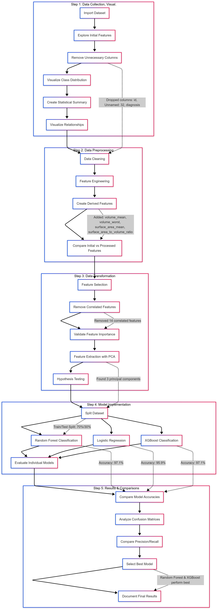

# 🩺 Breast Cancer Classification Using Machine Learning

## 📌 Project Overview

This project applies machine learning techniques to classify breast cancer tumors as **benign** or **malignant** using the **Breast Cancer Wisconsin Diagnostic** dataset. It includes a complete pipeline: from data preprocessing, visualization, feature engineering, and hypothesis testing to model training and evaluation.

> **Author**: Rajat Kumar Thakur  
> **Roll No.**: 202211070  
> **Course**: Data Analytics & Visualization (CS/IT 312)

---

## 📊 Dataset Summary

- **Total Samples**: 569  
- **Classes**:
  - **Benign (B)**: 357
  - **Malignant (M)**: 212  
- **Source**: [Breast Cancer Wisconsin Diagnostic Dataset](https://archive.ics.uci.edu/dataset/17/breast+cancer+wisconsin+diagnostic)

---

## 🧭 Workflow

The workflow includes multiple steps for a comprehensive analysis and model implementation.

### 🧮 Step 1: Data Collection & Visualization
- **Initial Checks**: Data types, missing values, outliers
- **Cleaning**: Removed `id`, `Unnamed: 32`, and other irrelevant columns
- **Visualizations**:
  - Box Plot
  - Joint Plot
  - Violin Plot
  - Swarm Plot
  - Heatmap

---

### 🧼 Step 2: Data Preprocessing & Feature Engineering

#### 🔧 Engineered Features (20 Total), e.g.:
- `volume_mean` = (4/3)π(radius_mean)^3
- `surface_area_to_volume_ratio` = surface_area_mean / volume_mean
- `radius_ratio`, `compactness_ratio`, `texture_difference`, etc.

#### 📈 Visualization of Engineered Features:
- Line Charts
- Scatter Plots
- Bubble Charts
- Pie Chart (for class balance)
- Histograms (for distribution comparison)
- Heatmap
- Dendrogram (for clustering)
- PCA Plot (scatter)  
- t-SNE Plot (for class separability)

---

### 🔁 Step 3: Feature Selection & Transformation

- **Techniques Used**:
  - **Mutual Information**
  - **Recursive Feature Elimination (RFE)**
  - **Random Forest Feature Importance**

- **Final Selected Features (9)**:
  - `volume_worst`, `volume_mean`, `perimeter_difference`, `surface_area_mean`, etc.

- **Transformation**:
  - Standardization (Z-score normalization)
  - PCA (for dimensionality reduction)

---

### 🔬 Step 4: Hypothesis Testing

- **Tests Conducted**:
  - T-test (e.g., `texture_difference`)
  - Chi-Square Test
  - Wilcoxon Rank-Sum Test
  - ANOVA
  - t-SNE for 2D visualization

All tests confirmed statistical significance in differentiating between benign and malignant classes.

---

### 🤖 Step 5: Model Implementation

- **Models Used**:
  - Random Forest
  - Logistic Regression
  - XGBoost
  - Decision Tree
  - KNN
  - SVM
  - GaussianNB
  - AdaBoost
  - Gradient Boosting
  - MLPClassifier

- **Train-Test Split**: 70:30

---

### 🧠 Step 6: Evaluation & Best Model

- **Metrics Used**:
  - Accuracy
  - Precision
  - Recall
  - F1-Score

> **Best Performing Model**:  
> **XGBoost** due to high recall, balanced precision, F1-score, and robustness.

---

## 📎 Tools & Libraries

- **Languages**: Python  
- **Data Handling**: Pandas, NumPy  
- **Visualization**: Matplotlib, Seaborn  
- **ML & Feature Selection**: Scikit-learn, XGBoost  
- **Model Evaluation**: Scikit-learn Metrics, Statistical Tests

---

## 📚 Key Learnings

- Full pipeline implementation for a classification task  
- Importance of feature engineering and statistical testing  
- Effective use of visualizations and multivariate plots  
- Comparison of classical and ensemble learning models  

---

## 📷 Workflow Diagram

---
