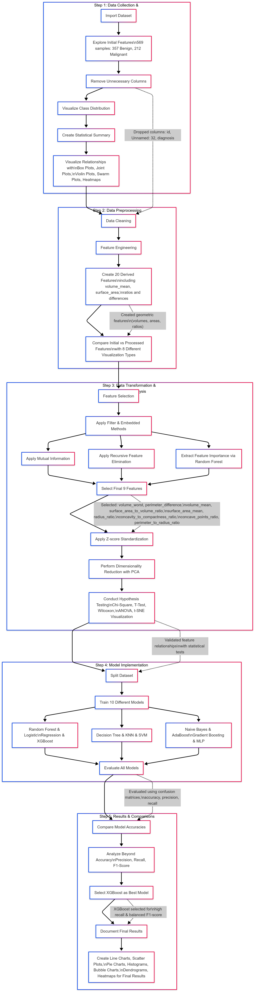

# 🩺 Breast Cancer Classification Using Machine Learning

## 📌 Project Overview

This project applies machine learning techniques to classify breast cancer tumors as **benign** or **malignant** using the **Breast Cancer Wisconsin Diagnostic** dataset. It involves the complete pipeline: from data preprocessing and visualization to model implementation and performance evaluation.

> **Author**: Rajat Kumar Thakur  
> **Roll No.**: 202211070  
> **Course**: Data Analytics & Visualization (CS/IT 312)

---

## 📊 Dataset Summary

- **Total Samples**: 569  
- **Classes**:
  - **Benign (B)**: 357
  - **Malignant (M)**: 212  
- **Source**: Breast Cancer Wisconsin Diagnostic Dataset

---

## 🧭 Workflow

The project workflow is divided into 5 key stages:

### 🧮 Step 1: Data Collection & Visualization
- **Import Dataset**  
- **Explore Initial Features**: Identify types, missing values, and outliers  
- **Data Cleaning**: Remove unnecessary columns such as `id`, `Unnamed: 32`, and others if present  
- **Visual Analysis**:
  - Distribution of classes
  - Relationships between features
- **Statistical Summary** of the dataset

📈 **Plots Used**:
- Box Plot
- Joint Plot
- Violin Plot
- Swarm Plot
- Heatmap

---

### 🧼 Step 2: Data Preprocessing & Feature Engineering
- **Data Cleaning**: Handling missing values and anomalies
- **Feature Engineering**: Created 4 new features using the raw data:
  - `volume_mean` = \( \frac{4}{3}\pi \cdot \text{radius\_mean}^3 \)
  - `volume_worst` = \( \frac{4}{3}\pi \cdot \text{radius\_worst}^3 \)
  - `surface_area_mean` = \( 4\pi \cdot \text{radius\_mean}^2 \)
  - `surface_area_to_volume_ratio` = \( \frac{\text{surface\_area\_mean}}{\text{volume\_mean}} \)

📊 **Visualization**:
- Histograms with KDE curves to compare the distribution of original and newly engineered features.

---

### 🔁 Step 3: Data Transformation
- **Feature Selection**: 
  - Employed the **Filter Method** to remove redundant features using correlation heatmap analysis.
  - Selected **20 representative features**.
- **Feature Scaling**: Standardization to ensure zero mean and unit variance.
- **Dimensionality Reduction**:
  - Utilized **Principal Component Analysis (PCA)** to reduce dimensionality while preserving significant variance.
- **Hypothesis Testing**:
  - A paired **t-test** between `radius_mean` and `area_mean` was performed to detect significant differences and reduce multicollinearity.

---

### 🤖 Step 4: Model Implementation

- **Data Splitting**: 
  - Divided data into Training (70%) and Test (30%) sets.
- **Models Applied**:
  - Random Forest Classifier
  - Logistic Regression
  - XGBoost Classifier

🔍 **Performance Overview**:
- **Accuracy**:
  - Random Forest: 97.1%
  - Logistic Regression: 95.9%
  - XGBoost: 97.1%

---

### 🧠 Step 5: Results & Comparisons

- **Model Evaluation**:
  - Detailed comparison based on Accuracy, Precision, Recall, and F1-Score.
- **Best Model Determination**:
  - Random Forest and XGBoost emerged as top performers with high accuracy and balanced classification metrics.

---

## 📌 Feature Selection Strategy

- Selected **20** key features using correlation analysis to reduce redundancy.
- Principal Component Analysis further streamlined the dataset for enhanced performance and lower risk of overfitting.

---

## 📎 Tools & Libraries

- **Python** (Programming Language)
- **Pandas, NumPy** (Data Manipulation)
- **Matplotlib, Seaborn** (Data Visualization)
- **Scikit-learn** (Machine Learning)
- **XGBoost** (Gradient Boosting)

---

## 📚 Key Learnings

> The project provided hands-on experience with:
- Data cleaning and exploratory data analysis (EDA)
- Feature engineering, selection, and transformation techniques
- Implementation and evaluation of multiple classification algorithms
- Visualization techniques to draw insights from data

---

## 📁 Repository Structure

---

## 📷 Workflow Diagram

---